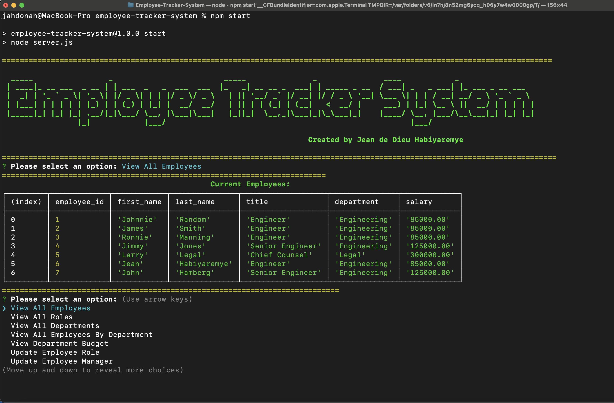

# Employee-Tracker-System

## Description
```md
create interfaces that allow non-developers to easily view and interact with information stored in databases
Using Node.js, Inquirer, and PostgreSQL.
```
## Table of Contents

- [Description](#describution)
- [Table of Contents](#table-of-contents)
- [Installation](#installation)
- [User Story](#user-story)
- [Acceptance Criteria](#acceptance-criteria)
- [Usage](#usage)

- [Authors and Contributors](#authors-and-contributors)
- [License](#license)
- [Test](#test)
- [Github Repository Link](#github-repository-link)
- [Google Drive Link Hosting the video](#google-drive-link-hosting-the-video)
- [Contact Me](#contact-me)

## Installation
```md
This Web Application will be run under the terminal or command prompt. Installation required will be node so that it will allow to run js (Javascript) 
the requirer version 8.2.4. and PostgreSQL for database management

```
## User Story

```md
AS A developer I want to create an application so that a business owner
could be able to view and manage the departments, roles, and employees in his company
SO THAT he or she  can organize and plan his/her business
```

## Acceptance Criteria
```md
GIVEN a command-line application that accepts user input
WHEN I start the application
THEN I am presented with the following options: view all departments, view all roles, view all employees, add a department, add a role, add an employee, and update an employee role
WHEN I choose to view all departments
THEN I am presented with a formatted table showing department names and department ids
WHEN I choose to view all roles
THEN I am presented with the job title, role id, the department that role belongs to, and the salary for that role
WHEN I choose to view all employees
THEN I am presented with a formatted table showing employee data, including employee ids, first names, last names, job titles, departments, salaries, and managers that the employees report to
WHEN I choose to add a department
THEN I am prompted to enter the name of the department and that department is added to the database
WHEN I choose to add a role
THEN I am prompted to enter the name, salary, and department for the role and that role is added to the database
WHEN I choose to add an employee
THEN I am prompted to enter the employee’s first name, last name, role, and manager, and that employee is added to the database
WHEN I choose to update an employee role
THEN I am prompted to select an employee to update and their new role and this information is updated in the database 
```

## Usage

```md
Open a terminal or a command prompt, and then using command navigate according to the path and reach to the folder containing the project then open the file by using the following command [npm start]. Once the node is installed and requirer version 8.2.4 are installed you will be asked to respond to the questions after responding a question press enter to view the selected item.

```
## Mock Up

The following images show the web application's appearance and functionality:

* The image below shows the terminal and answers provided from different questions and so the successful message of the file creation

    

* The image below shows the README FILE CREATED OUT OF THE ANSWER PROVIDED
    
## Authors and Contributors

```md
This Application is designed and implemented by Jean de Dieu Habiyaremye, a 2024 bootcamp students hosted by edx partering with MSU. This application is made possible through different guidance and advice of the Professor Jung and si different Teacher Assistance of the bootcamp
```
## License

```md
This application is under the License of MIT
```

For more details Click on License Badge   

[](LICENSE)
## Github Repository Link

[Github Repository Link](https://github.com/jahdona/Employee-Tracker-System)

## Google Drive Link Hosting the video

[Google Drive Link Hosting the video](https://drive.google.com/file/d/1to8YsrusDyP613BpZPjmNMZ2OuJpQIHQ/view)

## Test

```
In order to run a test type the following comnmnand in terminal: npm test
```
## Contact Me

```md
For further details contact me through phone +1(616)-441-9202 and on my Email: jahdonah@yahoo.com
```

